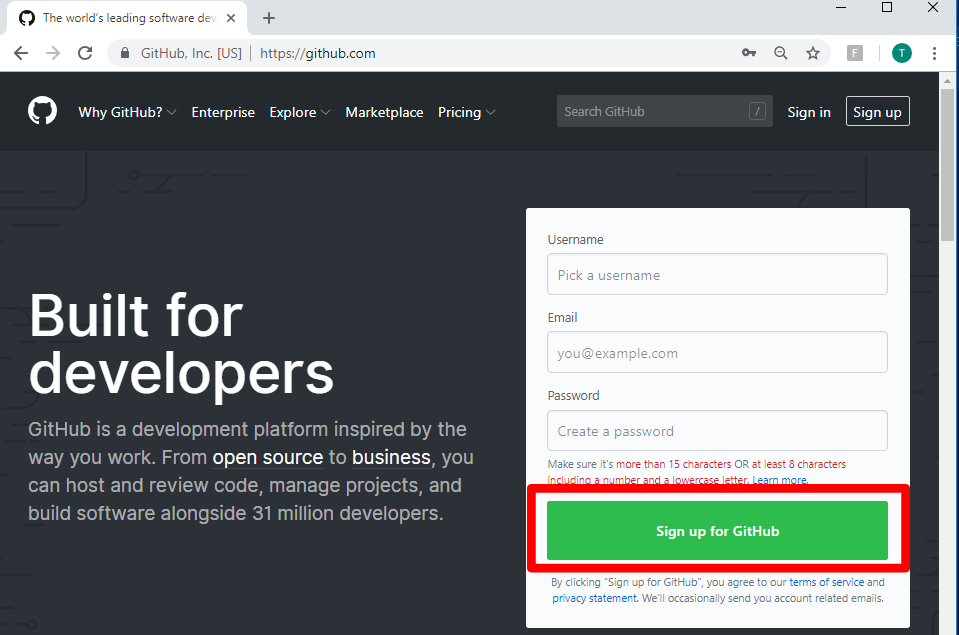
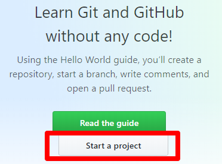
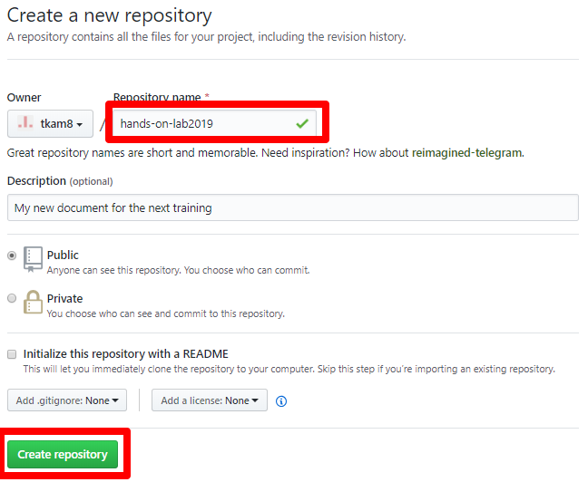

Module 1: GitHub Setup
===========================

GitHub is a web-based platform used mainly for software code version control. You will use it to store content for your documentation project and manage it in the same way as code. 

Why GitHub?
------------
- **Scale**: Multiple people can contribute to the repository by pull request
- **Easy to Update**: Anyone with Internet access and a text editor can send a pull request
- **Version Control**: 
      - Multiple versions of a constantly changing document can create confusion
      - Original project is the source of truth
- **Promote Collaboration**: Everyone has good ideas that should be shared
- **Foreign Language Support**: Your country may require some localization of documentation

Instructions:

#. Access `GitHub <https://github.com>`__ and create an account if you do not already have one

   |mod-1-1|

#. Click **Start a project**

   |mod-1-2|

#. Type in a name for your new repo. Leave the **Initialize this repository with a README** unchecked as there is already a README, .gitignore, and license file in this template. 

   |mod-1-3|

This completes GitHub setup. You now have a blank repository in your GitHub account. 

Other files and folder in this directory:
------------------------------------

docs/**class2**/**module1**/**images**
~~~~~~~~~~~~~~~~~~~~~~~~~~~~~~
Folder used to store images used in module1.rst  

