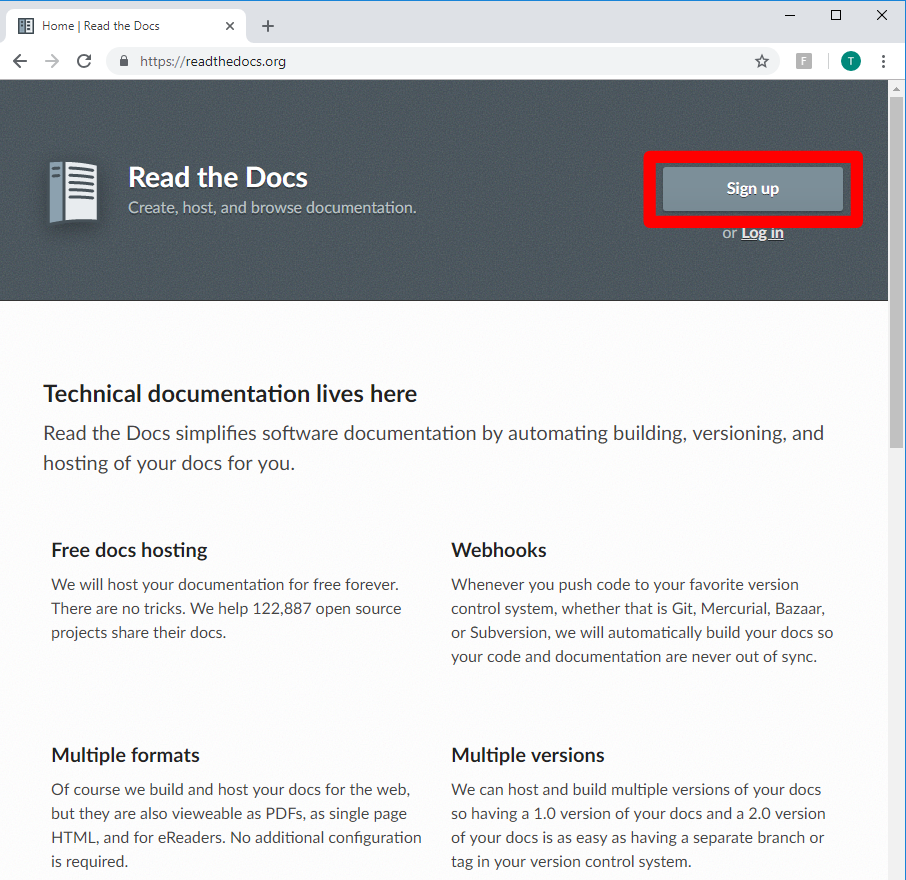
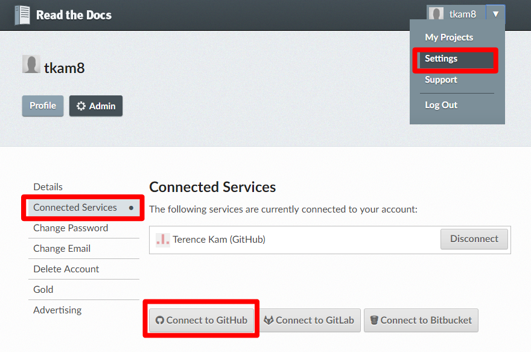
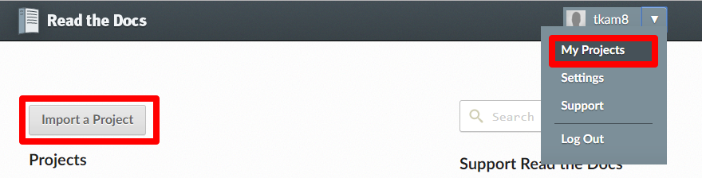
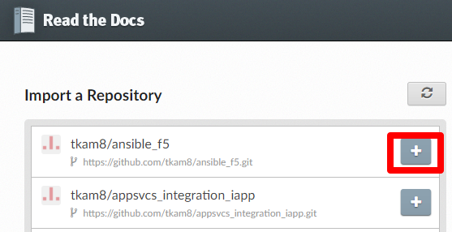

Module 2: Read The Docs Setup
===========================

Read the Docs is a free document hosting service that will build the HTML files necessary to display your document online. 

Why Read the Docs?
------------------
- **Integrates with GitHub via Webhook**
- **Stays in sync with latest changes**
      - Integrates with GitHub via webhook to convert the latest changes to HTML and PDF in real time
- **Easily distributable**
      - Access via public URL or export to PDF

Instructions:

#. Access `Read the Docs <https://readthedocs.org/>`__ and create an account if you do not already have one 

   |mod-2-1|

#. In the top right corner, click **Settings**, then **Connected Services**. Grant access to your GitHub account you created earlier

   |mod-2-2|

#. In the tope right corner, click **My Projects**, then click **Import a Project**

   |mod-2-3|

#. Click the + button for the repository you created earlier to import into Read the Docs. 

   |mod-2-4|

This completes Read the Docs setup. Whenever you make a commit to the project's repo, Read the Docs will automatically build the document. 

Other files and folder in this directory:
------------------------------------

docs/**class2**/**module2**/**images**
~~~~~~~~~~~~~~~~~~~~~~~~~~~~~~
Folder used to store images used in module2.rst  

