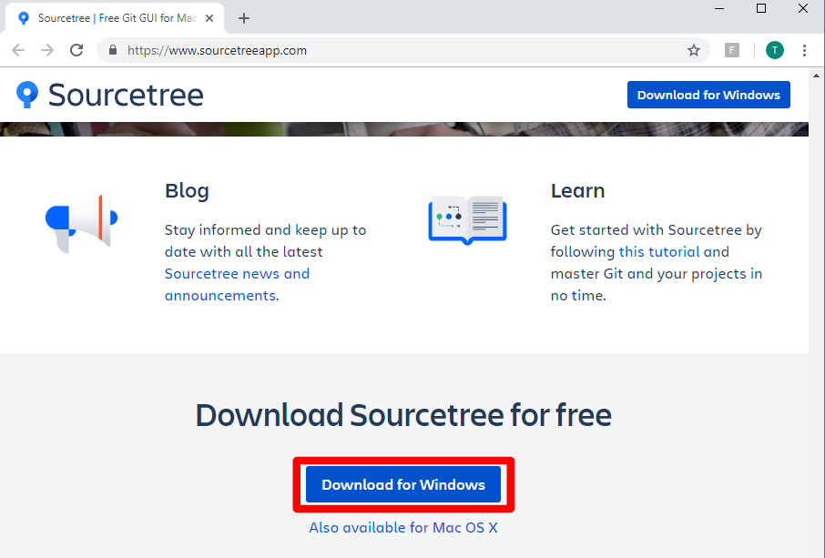

Module 3: Sourcetree Setup
===========================

`Sourcetree <https://www.sourcetreeapp.com/>`__ is a Git client for that makes it easy to manage your repository from your PC. Supports Windows and macOS. 

Why Sourcetree?
------------------
- **Simple for beginners**
      - Provides a GUI to confirm your changes and can sync with your repo
- **Good visualization**
      - Displays a diff of the current and new data
      - Displays a history of changes

Instructions:

#. Access `Sourcetree <https://www.sourcetreeapp.com/>`__ and download the app (Windows or Mac OS X)

   |mod-3-1|

#. Install Sourcetree. Use the setup wizard to guide you to create an Atlassian account and connect to GitHub. You will clone a repository in the next class. Refer to the `install guide <https://confluence.atlassian.com/get-started-with-sourcetree/install-sourcetree-847359094.html>`__ if needed. 

This completes the Sourcetree setup. You can now use this application to manage commits to your respository.

Other files and folder in this directory:
------------------------------------

docs/**class2**/**module3**/**images**
~~~~~~~~~~~~~~~~~~~~~~~~~~~~~~
Folder used to store images used in module3.rst  

