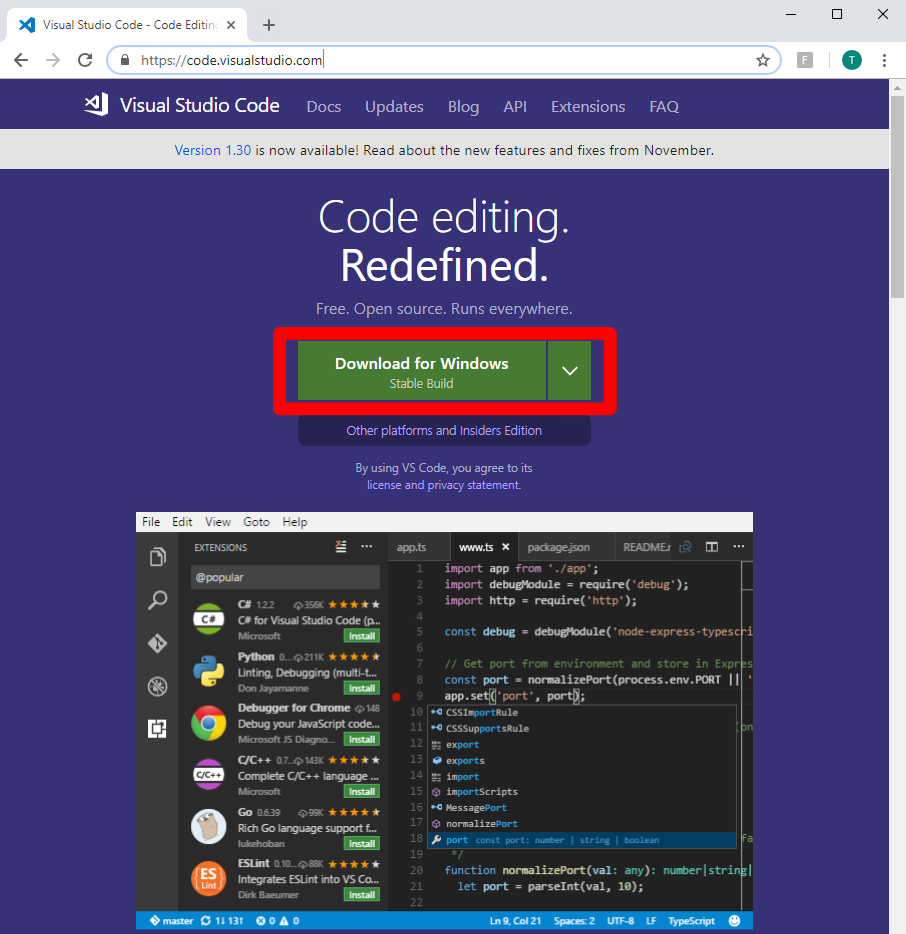

Module 4: VS Code Setup
===========================

`Visual Studio Code <https://code.visualstudio.com/>`__ is a free code editing application that you can use to edit your documentation content. Feel free to choose another code editor of choice.

This template will use `reStructuredText <http://docutils.sourceforge.net/rst.html>`__ markup syntax to format the text displayed in Read the Docs. VS Code can help to identify syntax errors. 

Why VS Code?
------------------
- **Simple for beginners**
      - Easy to install, use, and update
      - Source Control functionality
      - Recognizes many languages for syntax checking
- **Compatibility**
      - Available for Windows, macOS, Linux
- **Extensible**
      - Many extensions for adding various features

Instructions:

#. Access `VS Code <https://code.visualstudio.com/>`__ and download the app (Windows or Mac OS X)

   |mod-4-1|

#. Install VS Code. Follow the official guide for your OS as needed: 

 ``https://code.visualstudio.com/docs/setup/setup-overview``

This completes the VS Code setup. You can now use this application to edit your document contents in restructuredText.

Other files and folder in this directory:
------------------------------------

docs/**class2**/**module4**/**images**
~~~~~~~~~~~~~~~~~~~~~~~~~~~~~~
Folder used to store images used in module4.rst  

