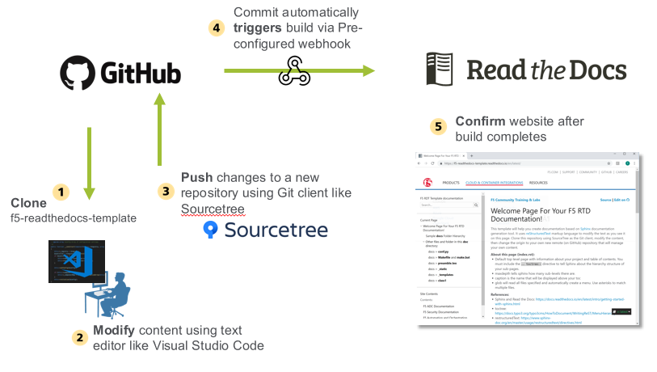

Workflow
========

See below image for an overview of the steps needed to create your document.

|workflow-1-1|

#. Cloning the repository will ensure you have a copy of all the files and directories. Cloning is different from forking, which is used when you intend to contribute back to the original project. Here you clone it to your local workspace. 

#. You can use any text editor of choice. `VS Code <https://code.visualstudio.com/>`__ runs on Windows or macOS and has many useful extensions that help you write your document/code. 

#. Sourcetree will commit local changes to your remote GitHub repository. `Sourcetree <https://www.sourcetreeapp.com/>`__ also runs on Windows or macOS and help you visually track changes. 

#. A `Webhook <https://developer.github.com/webhooks/>`__ is used to trigger a new Read the Docs build whenever you make a commit to GitHub. 

#. Once the Read the Docs build is complete, your content is automatically published in the following format: 
  ``https://<GitHub repository name>.readthedocs.io/en/latest``

