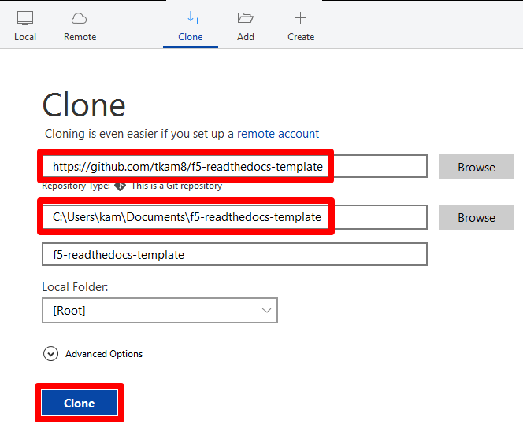
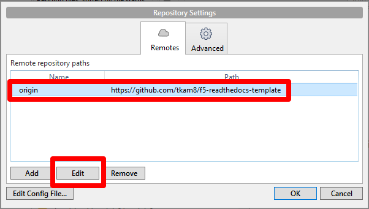
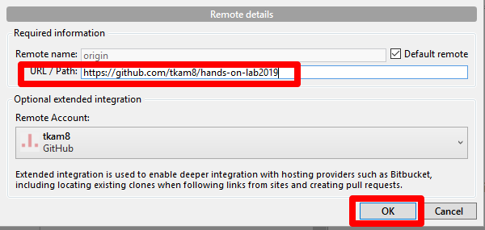

Module 1: Clone Template to Local
===========================

You will clone the `f5-readthedocs-template <https://github.com/tkam8/f5-readthedocs-template>`__ to your PC so you can edit the local copy. 

Cloning the repository will ensure you have a copy of all the files and directories. Cloning is different from forking, which is used when you intend to contribute back to the original project. Here you clone it to your local workspace. 

Instructions:

#. From Sourcetree, click the **File** menu > **Clone/New**

#. Paste the URL of the f5-readthedocs-template repository.  Select a local destination if you want to change it from default, click **Clone**

``https://github.com/tkam8/f5-readthedocs-template``

   |mod-1-1|

#. In order to commit changes to your own repository, you must change the remote origin path. Click the **Repository** menu > **Repository Settings...**, select the origin repository path and click **Edit**

   |mod-1-2|

#. Paste the URL to your empty repository and click **OK**

   |mod-1-3|

This completes cloning the template. You now have a local copy of the f5-readthedocs-template, which are all the files necessary to create a document on Read the Docs. You also changed the origin to point to your own personal repository.

Other files and folder in this directory:
------------------------------------

docs/**class2**/**module1**/**images**
~~~~~~~~~~~~~~~~~~~~~~~~~~~~~~
Folder used to store images used in module1.rst  

