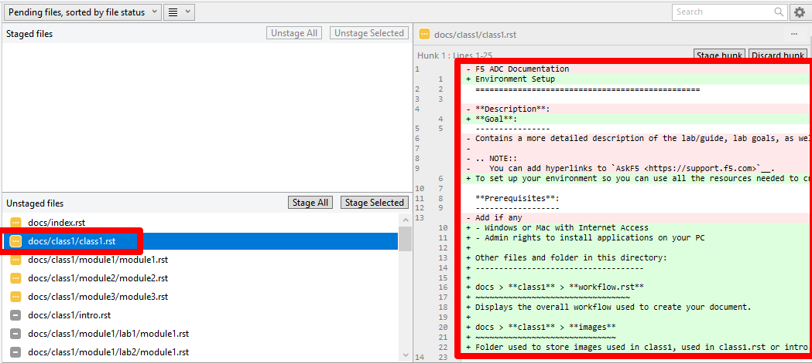
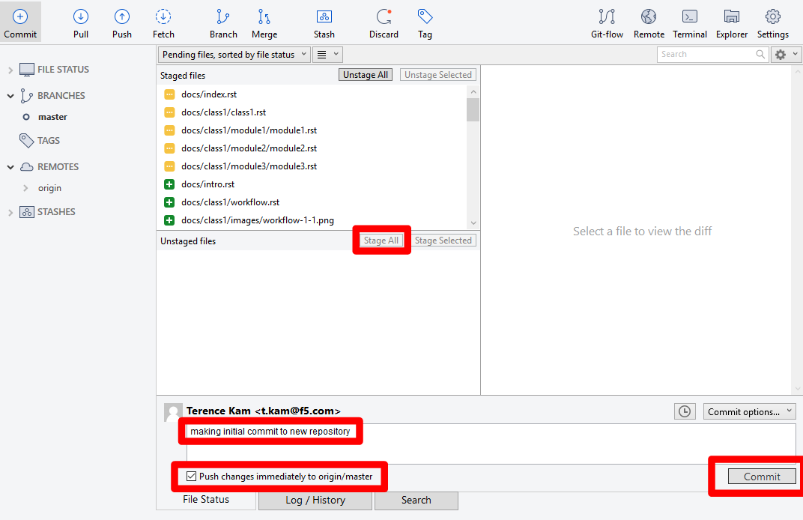

Module 1: Confirm and Commit Changes from Sourcetree
===========================

You will commit changes to your repository, which will trigger a build on Read the Docs.

Instructions:

#. From Sourcetree, the **Unstaged files** box will show the files you have modified. You can click each file to see a diff of the changes 

   |mod-1-1|

#. Click **Stage All** to prepare them for commit. Then type in a comment in the comment box describing the changes, check **Push changes immediately to origin/master**, then click Commit to apply the changes to your GitHub repository.

   .. NOTE::
      Sourcetree will upload all files and folders to your new repository. 

   |mod-1-2|

This completes committing changes to GitHub repository.

Other files and folder in this directory:
------------------------------------

docs/**class3**/**module1**/**images**
~~~~~~~~~~~~~~~~~~~~~~~~~~~~~~
Folder used to store images used in module1.rst  

