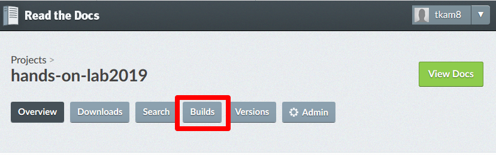
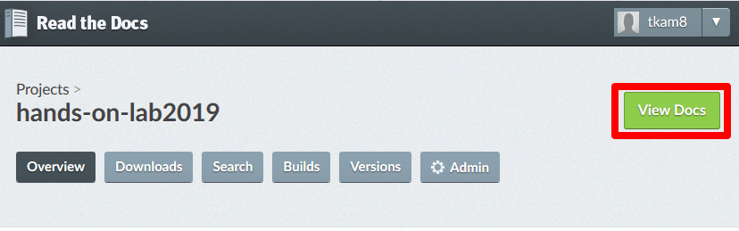

Module 2: Confirm build and Document in Read the Docs
===========================

You will clone the `f5-readthedocs-template <https://github.com/tkam8/f5-readthedocs-template>`__ to your PC so you can edit the local copy. 

Cloning the repository will ensure you have a copy of all the files and directories. Cloning is different from forking, which is used when you intend to contribute back to the original project. Here you clone it to your local workspace. 

Instructions:

#. Once the GitHub commit is complete, navigate to your project on Read the Docs, and click on **Builds** to confirm the build process completes.

   |mod-2-1|

#. Once the build is complete (passed), you can click on **View Docs** to display your new documentation. 

   |mod-2-2|

This completes the final steps to create your documentation. You can continue to update the content as necessary and the changes will automatically be reflected on your website.

Other files and folder in this directory:
------------------------------------

docs/**class3**/**module2**/**images**
~~~~~~~~~~~~~~~~~~~~~~~~~~~~~~
Folder used to store images used in module2.rst  

